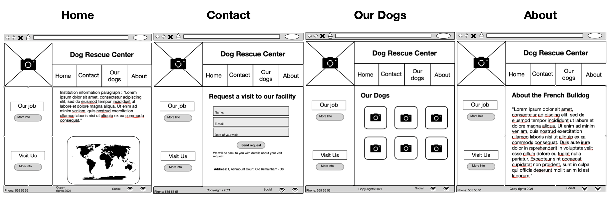

# Interactive Frontended Development Milestone Project - 2 Rescue Center

[View the live project here.](project url)

## UX

The purpose of this website is to find a home for rescue dogs, with the public visiting the institution facility's and having contac with their dogs.

### User Stories
#### First time visitor goals:
* As a First Time Visitor, I want to find a dog to recue it.
* As a First Time Visitor, I want to know about the rescue center work.

#### Returning visitor goals:
* As a Returning Visitor, I want to request a visit to their facility.
* As a Returning Visitor, I want to follow their social media.

#### Frequent user goals:
* As a Frequent User, I want to engage with the institution and their dogs.
* As a Frequent User, I want to ...

## Features

The visitot to this website can find in the home page a map of the institution location linked to google maps API, can request a visit filing a e-mail form in the contact page also can see pictures of the dogs in our dogs page and know more about the breeed in the about page.

## Future features

Future features

## Technologies Used
1. [Git](https://git-scm.com/) Was used for version control by utilizing the Gitpod terminal to commit to Git and push it to GitHub. 
2. [GitHub](https://github.com) Used to store the project after it has been pushed from Git.
3. [Boostrap](https://getbootstrap.com/) The Bootstrap library was used throughout the project to assist with the responsiveness and styling of the website.
4. [FontAwesome](https://fontawesome.com/) The project uses Font Awesome icons.
5. [Google Fonts](https://fonts.google.com/) Google fonts were used to homogenize the project. The font imported to the style.css file was 'Overpass'.
6. [Google Maps](https://www.google.com/maps) Google maps were used to show Dublin in the contact section.
7. [jQuery](https://jquery.com/) jQuery was used to make the navbar responsive and also used for the modal dialog.

## Design

* ### Colour Scheme

For the colour scheme I used [Coolors.co](https://coolors.co/palettes/trending)

I choose shades of red, orange and yellow for the different levels. Red for level 3, orange for level 2 and yellow for level 1.

* ### Typography

 

* ### Design choices

I based the structure of the website in the Rosie Resume mini project.
In all pages I used the Rule of Thirds.

* ### Wireframe.

## Languages used
* HTML 5
* CSS 3
* JavaScript

## Testing

### Testing User Stories from User Experience (UX) Section

#### First Time Visitor Goals
##### * User Story 
1. 
2. 

3. 

##### * User Story
1. 

2. 

#### Returning Visitor Goals
##### * User Story
1. 
2. 

##### * User Story
1. 

#### Frequent User Goals
##### * User Story
1. 

##### * User Story
1. 

##### * User Story
1. 

## Fixed Bugs

## Validation

* Lighthouse Google Chrome Tools  ????????????

|    |Mobile |Desktop |
|--- |--- |--- |
|Performance|??|??|
Accessibility|??|??|
Best Practices|??|??|
SEO|???|???|

## Deployment

### Git Commands
After writing the code on Gitpod, I used the Git Commands:

* git add and file or directory name, adds files to the staging area for Git.
* git commit -m "message", record the changes made to the files to a local repository.
* git push, sends local commits to the remote repository on GitHub. 

### GitHub Pages
The deployment was deployed to the GitHub pages.
From my GitHub web page, I open the repository I want to deploy, in this case, “Username-projectname”. 
Then at the top right of the page click on the 'Settings' link, and scroll down to the GitHub Pages section, 
I selected the master branch as source, click on save, and I was provided with the following 
message: Your site is published at (project URL)/

### Forking the GitHub Repository

Once you locate the repository you want to fork, at the top right of the page below the right items in the navigation bar the fork button can be located.
Now you should have a copy of the original repository in your GitHub account.

### Making a Local Clone

You find step by step to how to clone a repository from GitHub to your computer on [GitHub Docs](https://docs.github.com/en/free-pro-team@latest/github/creating-cloning-and-archiving-repositories/cloning-a-repository) Cloning a repository from GitHub.

## Credits

### Code

### Content
All content was written by the developer.

### Media

### Acknowledgements

My Mentor Reuben Ferrante for his help and feedback.

Tutor support at Code Institute for their support.

To the Slack Community for helping me with my silly questions.
